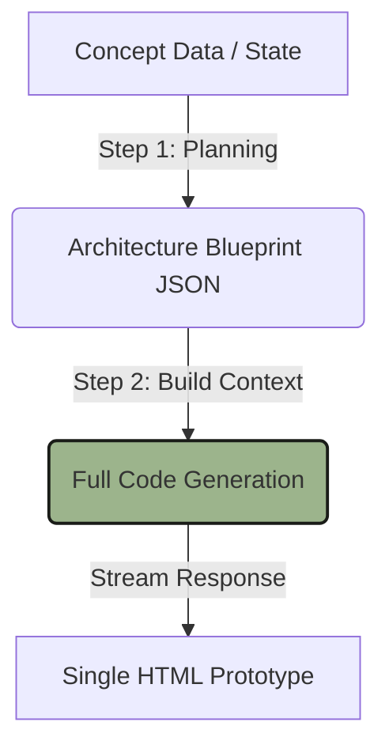

# 📊 Analisis Bottleneck Fitur AI — Projek DiverDea

Dokumen ini menyajikan analisis mendalam mengenai **bottleneck (hambatan/kendala utama)** pada fitur-fitur bertenaga AI di dalam aplikasi **DiverDea (Synthesis Engine)** dari segi fitur, fungsionalitas, arsitektur, dan UX. Analisis ini bertujuan untuk mengidentifikasi area yang membatasi performa, keandalan, dan kegunaan aplikasi, serta memberikan rekomendasi solusi konkret untuk pengembangan fase berikutnya.

---

## 🧭 Ringkasan Eksekutif
DiverDea telah berhasil mengintegrasikan kecerdasan buatan (AI) di berbagai lini: perencanaan konsep (**AI Concept Planner**), validasi kelayakan (**AI Idea Validator**), kompilasi kode prototype (**AI Prototype Compiler**), hingga integrasi agen AI aktif di dalam aplikasi yang dihasilkan (**App AI Integration**).

Namun, dari segi fitur, terdapat beberapa **bottleneck sistemik** yang membatasi potensi penuh mesin ini. Bottleneck terbesar terletak pada **keterbatasan token output model (truncation)** saat mengompilasi kode prototype kompleks, **kekakuan iterasi konsep** (satu arah/non-interaktif), **kerentanan parsing JSON**, serta **risiko keamanan API Key** pada sisi klien (client-side leakage).

---

## 🔍 Analisis Bottleneck per Fitur AI

### 1. AI Concept Planner (`solveWithAI` & `tweakAiConcept`)
Fitur ini bertugas mengubah masalah dunia nyata atau domain menjadi 3 konsep aplikasi terstruktur berbasis JSON.

| Hambatan (Bottleneck) | Deskripsi Masalah | Dampak Terhadap Pengguna (UX) |
|---|---|---|
| **Iterasi Kaku & Satu Arah (*Single-turn Constraint*)** | Proses tweaking (`tweakAiConcept`) bersifat destruktif dan menggantikan objek konsep aktif secara langsung. Tidak ada antarmuka percakapan (chat sidebar) untuk mendiskusikan revisi secara bertahap. | Pengguna tidak bisa melakukan *fine-tuning* konsep secara kolaboratif; mereka terpaksa menulis perintah tweak berulang-ulang dari nol. |
| **Kekakuan Skema Kategori (*Resolved - Hybrid Custom Input*)** | **[TERATASI]** Sebelumnya, LLM dipaksa memilih kategori utama dan pendukung secara ketat dari 28 kategori bawaan. Sekarang, pengguna dapat mengetikkan kategori kustom apa pun dan sistem akan mendaftarkannya secara dinamis di memori reaktif. | Memberikan otonomi lateral mutlak kepada pengguna untuk menggabungkan domain sains, seni, atau subyek ekstrem tanpa batas dropdown. |
| **Kerentanan Kegagalan Parsing (*JSON Fragility*)** | Bergantung sepenuhnya pada LLM untuk mengembalikan struktur JSON yang 100% valid. Metode pembersihan string (`firstBrace` hingga `lastBrace`) hanya mengatasi pembungkus markdown, bukan kesalahan sintaksis JSON internal. | Jika LLM mengalami halusinasi, lupa menutup tanda kurung, atau menambahkan koma menggantung (*trailing comma*), aplikasi akan *crash* dan memicu error parsing. |
| **Dominasi Game di Domain Pendukung (*Repetitive Game Secondary Category*)** | **[TERATASI]** Prompt perencana konsep sebelumnya selalu menggunakan kata kunci "aplikasi atau game" dan "gamifikasi" secara berlebih, memicu LLM untuk selalu memilih 'Game 2D' atau 'Game 3D' sebagai kategori pendukung. Sekarang, prompt diatur menggunakan kata kunci 'startup/solusi digital kreatif' dengan instruksi negatif tegas untuk mendiversifikasi kombinasi non-game lateral. | Menghilangkan kejenuhan konsep; kini AI dapat merancang konsep hibrida non-game yang kaya seperti Fintech + Health atau Productivity + Green-Tech tanpa dipaksa menjadi game loop. |
| **Ketiadaan Input Referensi Kode/UI** | Planner hanya bekerja dengan input teks masalah atau domain. Pengguna tidak dapat menyuntikkan preferensi visual spesifik atau pustaka luar di fase perencanaan ini. | Konsep yang dihasilkan kadang memiliki gaya visual atau dependensi pustaka yang tidak sesuai dengan ekspektasi developer. |

> [!WARNING]
> **Akar Masalah JSON Fragility:** LLM generatif dirancang untuk memprediksi teks, bukan mematuhi spesifikasi parser biner secara ketat. Tanpa *structured outputs* (seperti `response_format: { type: "json_object" }` di OpenAI/Groq atau schema constraint di Gemini), kegagalan parsing akan selalu membayangi sistem.

---

### 2. AI Idea Validator (`checkConceptViability` & `applyViabilityTweak`)
Fitur untuk menguji kelayakan startup dan kelayakan teknis dari konsep terpilih, serta menerapkan saran optimasi secara otomatis.

*   **Analisis Statis & Dangkal:** Evaluasi kelayakan didasarkan pada satu kali tembakan prompt statis. AI tidak memverifikasi data pasar aktual, tren pencarian, pustaka npm yang nyata, atau tingkat kesulitan coding yang sebenarnya. Skor 1-10 terasa seperti tebakan LLM subjektif.
*   **Bottleneck "Double LLM Roundtrip" (Lag UX):** 
    Proses perbaikan otomatis (`applyViabilityTweak`) memerlukan satu request AI untuk memperbarui konsep JSON, diikuti secara otomatis oleh request AI kedua (`checkConceptViability`) untuk memperbarui skor. Pengguna harus menunggu dua kali antrean API yang memakan waktu cukup lama (10-15 detik) di mana UI terasa membeku jika koneksi lambat.
*   **Keterbatasan Penjelasan Deskriptif:**
    AI dipaksa menjawab dalam batasan ketat: *1 kalimat singkat Bahasa Indonesia* untuk `marketFit`, `reason`, dan `tweak`. Untuk konsep hibrida yang sangat kompleks, satu kalimat tidak mampu menguraikan arsitektur teknis yang berisiko atau hambatan integrasi yang mendalam.

---

### 3. AI Prototype Compiler / Generator (`sendToAI` - 2-Step Chain)
Fitur mahkota DiverDea yang mengompilasi konsep, mekanik, API, dan visual menjadi satu file HTML siap pakai melalui alur 2 langkah: *Architecture Planning* ➔ *Full Code Build*.

#### 🚨 Bottleneck Terbesar: Truncation & Token Limit (Keterbatasan Token Output)
Ini adalah **bottleneck paling kritis** di seluruh ekosistem DiverDea:
1.  **Output Terpotong (Truncated Code):** Target model (seperti `llama-3.1-8b-instant` atau `gemini-3-flash`) memiliki batas token keluaran maksimum (biasanya 2,048 hingga 8,192 token). 
2.  **Saturasi Kompleksitas:** Ketika pengguna mengaktifkan hingga 5 mekanik, SPA menu navigasi, integrasi API eksternal, visualisasi grafik (ChartJS), manipulasi suara (Tone.js), dan efek animasi (GSAP), ukuran kode HTML tunggal yang harus ditulis AI dengan mudah menembus **10,000+ token**.
3.  **Akibat:** AI berhenti menulis di tengah-tengah tag `<script>` atau di pertengahan logika Vue, menghasilkan file HTML rusak dengan tag tak tertutup (*incomplete layout/syntax error*) yang tidak bisa dijalankan sama sekali.

#### ⚙️ Bottleneck Arsitektur Rantai 2-Langkah (2-Step Chain)
*   **Tanpa Verifikasi Manusia di Tengah Rantai:** 
    Langkah 1 (Planning) langsung dilanjutkan ke Langkah 2 (Build) secara otomatis tanpa memberi kesempatan bagi user untuk meninjau, mengoreksi, atau menyetujui *Blueprint Arsitektur* yang dihasilkan. Jika di Langkah 1 AI merancang skema state yang salah atau memilih posisi menu yang buruk, sistem akan tetap membuang-buang token untuk menulis seluruh kode yang rusak di Langkah 2.
*   **Penurunan Kepatuhan Direktif (*Directive Fatigue*):**
    Saat memproses prompt super panjang yang berisi gabungan Blueprint Arsitektur (Step 1), instruksi teknis global, instruksi spesifik kategori (`categoryFocusMap`), dan panduan integrasi AI, model berukuran kecil (seperti 8B/9B) sering mengalami *attention fatigue*. AI mulai mengabaikan instruksi penting seperti "dilarang menggunakan emoji" atau "wajib menggunakan FontAwesome".

---

### 4. Aplikasi Hasil Generate (`projectUseAI` — Live AI Integration)
Sinergi mutakhir di mana prototipe yang dihasilkan dibekali kemampuan memanggil API Gemini/Groq secara langsung untuk fitur operasionalnya.

> [!CAUTION]
> **Kebocoran & Keamanan API Key (Client-Side Exposure)**
> Prototipe yang dihasilkan berjalan 100% di sisi klien (browser pengguna) tanpa server backend (serverless single HTML). Menyimpan API Key di LocalStorage browser dan mengirimkannya langsung lewat fetch HTTP di sisi klien adalah **celah keamanan fatal (security bottleneck)**. Jika prototipe tersebut dibagikan ke orang lain, API Key pengguna akan mudah diintip melalui tab *Network* atau *Application Console* di Chrome DevTools.

*   **Masalah Cross-Origin Resource Sharing (CORS):**
    Memanggil API AI langsung dari file HTML lokal (`file://`) dapat memicu penolakan CORS pada beberapa endpoint API pihak ketiga atau proxy kustom, sehingga mengharuskan pengguna memasang ekstensi bypass CORS atau menggunakan server lokal.
*   **Kerentanan Parser Agen AI (*State Mutation Fragility*):**
    Perintah "AI Agent Mode" mewajibkan AI membalas pesan sekaligus mengirimkan payload perintah terstruktur untuk mengubah state Vue (misal: memicu `addExpense()` saat user mengetik chat).
    Namun, mendesain parser perintah yang tangguh di dalam satu file HTML sangatlah sulit. Jika AI mengirimkan format pesan yang sedikit melenceng (misal: menaruh JSON di luar tag yang ditentukan), parser regex di prototipe akan gagal, menyebabkan error JavaScript yang memutus jalannya aplikasi.

---

## 🛠️ Rekomendasi Solusi & Rencana Perbaikan (Roadmap)

Untuk mengatasi bottleneck di atas dan meningkatkan DiverDea menjadi platform SaaS kelas profesional, berikut adalah langkah-langkah solutif yang direkomendasikan:

### 🌟 Fase 1: Mengatasi Truncation & Token Limit (Prioritas Utama)
*   **Penerapan Modular File Export (Zip Download):** 
    Alih-alih memaksa AI menulis satu file HTML raksasa yang menggabungkan CSS, JS, dan HTML, ubah prompt Step 2 untuk menulis beberapa file modular terpisah (e.g., `index.html`, `app.js`, `style.css`). Integrasikan pustaka client-side zip (seperti **JSZip**) agar DiverDea dapat mengunduh paket proyek terkompresi yang bersih.
*   **Strategi "Incremental Code Streaming & Merging":**
    Pecah langkah pembangunan kode menjadi sub-fase: generate struktur HTML & CSS terlebih dahulu, kemudian stream logika JavaScript/Vue secara terpisah, lalu gabungkan di sisi klien menggunakan JavaScript.

### 💬 Fase 2: Peningkatan Interaktivitas & UX AI Planner
*   **Penyediaan Chat Panel Iteratif (Conversational Concept Planner):**
    Ubah UI perencana konsep dari sekadar form input statis menjadi ruang obrolan interaktif (seperti ChatGPT sidebar). Biarkan pengguna mengobrol dengan AI Planner untuk merevisi bagian tertentu dari konsep secara dinamis sebelum disintesis ke mesin utama.
*   **Intervensi Cetak Biru (Blueprint Gatekeeper):**
    Hentikan rantai eksekusi setelah Step 1 selesai. Tampilkan *Architecture Blueprint JSON* dalam bentuk kartu visual yang interaktif kepada pengguna. Biarkan pengguna mencentang, mengedit, atau mengubah skema state dan komponen sebelum menekan tombol **"Lanjutkan ke Pembangunan Kode"** (Step 2).

### 🔒 Fase 3: Keamanan API & Ketangguhan Sistem Agen
*   **Simulasi Sandboxed Proxy Service:**
    Sediakan opsi *sandboxed backend utility* atau panduan bagi pengguna untuk menjalankan server proxy lokal kecil (misal menggunakan Node.js/Express minimalis) untuk menjembatani panggilan API Gemini/Groq secara aman tanpa memaparkan API Key langsung di sisi browser klien.
*   **Structured Output Constraint (Strict JSON Parsing):**
    Manfaatkan fitur **Structured Outputs / JSON Schema** bawaan API model jika tersedia (seperti mendefinisikan skema JSON Schema di payload Gemini API) untuk memastikan respons dari AI Planner, Validator, maupun Agen selalu mematuhi struktur data yang valid secara matematis tanpa kerentanan parsing.

---
*Dianalisis pada: Mei 2026 — v4.2 (AI Bottleneck & Architectural Assessment Report)*
